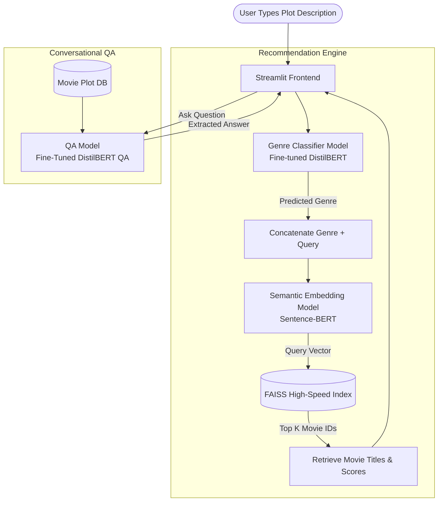

# Beyond the Star Rating: Building a Transformer-Powered Semantic Movie Recommendation System

Have you ever wanted to watch a movie with a very specific kind of story, but struggled to find it? Traditional movie recommendation systems usually rely on *collaborative filtering*—they look at user ratings, watch histories, and what similar users have liked. While effective for mainstream hits, they fall short when you have a specific plot in mind. 

What if you could just describe the story you want to see? 

This project is a **Plot-Based Semantic Movie Recommendation System**. It leverages cutting-edge Natural Language Processing (NLP) and Transformer models to recommend movies based purely on their narrative content. In this article, we'll dive into what this project is, how it works under the hood, and walk through a complete example.

---

## 🌟 What Does This Project Do?

At a high level, the application takes a natural language description of a plot from the user (e.g., *"A hacker discovers reality is a simulation"*) and performs three intelligent steps:
1. **Genre Inference:** It predicts the primary genre of the movie you're describing.
2. **Semantic Search:** It searches a database of movie plots to find the closest narrative matches, rather than just doing a simple keyword search.
3. **Conversational Question Answering (QA):** Once movies are recommended, a conversational AI allows you to ask specific questions about the plot of the recommended movies.

The interactive visual interface is built entirely using **Streamlit**, giving the user a sleek, responsive, and seamless experience.

---

## 🏗 System Architecture & Workflow

The architecture relies on a multi-model pipeline. Let's look at how the data flows from the user's brain to the final movie suggestion.

### 1. Genre Classification (DistilBERT)
When a user submits a query, it first goes to a fine-tuned **DistilBERT** classification model. Why predict the genre first? Because knowing the genre provides a powerful thematic filter. The model tokenizes the input and predicts the mathematical probability across 15 different genres. In testing, this Transformer model outperformed baseline Naive Bayes classifiers significantly (jumping from ~20% to ~61% accuracy on complex plot summaries).

### 2. Semantic Matching Engine (Sentence-BERT + FAISS)
Once the genre is predicted, we prepend it to the user's query (e.g., `"Sci-Fi: A hacker discovers reality is a simulation"`).
This combined text is encoded into a high-dimensional vector using a **Sentence-BERT** model. 

Because comparing this vector against tens of thousands of movie plots would be too slow, the system uses **FAISS (Facebook AI Similarity Search)**. FAISS allows the engine to perform lightning-fast nearest-neighbor searches in the vector space using *Cosine Similarity*. The top $K$ matches returned are the movies whose plots are narratively closest to what the user wants.

### 3. Conversational Question Answering (DistilBERT QA)
After the system suggests a few movies, you might want to know more about one of them without leaving the app. Using a secondary **DistilBERT QA** model, you can ask a direct question like, *"Who plays the main hacker character?"* 
The engine fetches the full text of the movie's plot from a local CSV database, passes the plot and your question into the QA model, and perfectly highlights and extracts the exact answer.

---

## 🔍 Example Walkthrough

Let's see the application in action.

**1. The Input:**
Imagine you are in the mood for an action-packed, mind-bending movie. You navigate to the Streamlit app and type the following into the text area:
> *"A hacker discovers a simulated reality controlled by machines and joins a rebellion."*

**2. The Classification:**
The system's genre classifier spinner activates and quickly returns:
> **Predicted Genre:** Sci-Fi

**3. The Recommendation:**
The Sentence-BERT model embeds `"Sci-Fi: A hacker discovers a simulated reality controlled by machines and joins a rebellion."` and queries the FAISS index. Immediately, it returns the top matches:
> 1. **The Matrix** *(Match Score: 0.8921)*
> 2. **The Thirteenth Floor** *(Match Score: 0.7645)*
> 3. **Dark City** *(Match Score: 0.7412)*

**4. The Follow-Up Q&A:**
Say you select **The Matrix** from the dropdown and type a follow-up question:
> *"Who is the leader of the rebellion?"*

Behind the scenes, the DistilBERT QA model reads *The Matrix* plot context, locates the start and end tokens of the answer, and outputs:
> **Answer:** Morpheus

---

## 🛠 Technology Stack
- **Python 3.10+**: The backbone of the application.
- **Transformers (Hugging Face)**: Used for robust NLP capabilities (`DistilBERT`, `Sentence-BERT`) for classification, embedding generation, and QA.
- **PyTorch**: The deep learning tensor framework running the Transformer models.
- **FAISS**: A library created by Facebook AI for efficient similarity search and clustering of dense vectors.
- **Streamlit**: Turns the complex Python scripts into an interactive, beautiful web UI in minutes.

## 💡 Conclusion
This project showcases the incredible shift happening in information retrieval and recommendation systems. By moving from keyword counting (like TF-IDF) and collaborative filtering to **semantic understanding** using dense vectors and Transformers, we can interact with media libraries in highly intuitive ways. You aren't just looking for a title; you're looking for an *experience*—and this engine understands exactly what you mean.
