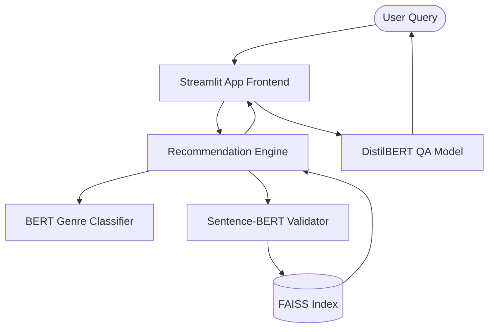

# 🎬 Plot-Based Movie Recommendation System

[](https://www.python.org/)
[](https://streamlit.io/)
[](https://huggingface.co/)
[](https://pytorch.org/)

This project presents a **plot-driven movie recommendation system** leveraging Natural Language Processing (NLP) and modern Transformer models. Unlike traditional systems that rely purely on user ratings or viewing history (collaborative filtering), this system focuses on the narrative essence of movies—the plot summaries and metadata—to deliver unbiased, narrative-based recommendations.

---

## ✨ Features

1. **Intelligent Genre Classification:**
   - Predicts movie genres directly from user queries using a fine-tuned BERT model.
   - Outperforms baseline models (like Naive Bayes) with a ~61% accuracy.

2. **Semantic Matching Engine:**
   - Utilizes `Sentence-BERT` embeddings mapped into a high-speed `FAISS` index.
   - Recommends the top movies based on exact cosine similarity of deep semantic plot embeddings.

3. **Interactive Visual Interface:**
   - A beautiful, responsive web UI built with Streamlit.
   - Seamlessly guides users from text input to final recommendations.

4. **Conversational Question Answering:**
   - A secondary fine-tuned DistilBERT QA model allows users to ask specific questions about a recommended movie's plot (e.g., *"Who are the main actors?"*).

---

## 🏗 Architecture & Workflow

The application is structured into a modular Python package for scalability and maintainability.



1. **User Input:** A text query describing movie preferences.
2. **Genre Prediction:** The system infers the mathematical probability of 15 genres.
3. **Recommendation Lookup:** The system retrieves top similar movies using high-dimensional space search in FAISS.
4. **Follow-up Interaction:** Users can interrogate the specific plot summary of recommended movies.

---

## 🚀 Getting Started

### Prerequisites

Ensure you have Python 3.10+ installed.

### Installation

1. Clone or navigate to the repository:
   ```bash
   git clone <repository-url>
   cd Plot_based_Movie_recommendation_system
   ```

2. Install the required Python packages:
   *Note: If on Apple Silicon (M1/M2/M3), ensure you are using TensorFlow and PyTorch versions optimized for ARM64.*
   ```bash
   pip install -r requirements.txt
   ```

3. **Download the Machine Learning Models:**
   Because the tuned Transformer models and FAISS indexes are over 500MB, they are hosted on Hugging Face. Run the automated script to securely download them into the local `data/` directory:
   ```bash
   python download_data.py
   ```

### Running the Application

To launch the web interface locally, simply run:

```bash
streamlit run app.py
```

The application will be accessible at `http://localhost:8501`.

---

## 📂 Project Structure

```text
├── app.py                      # Main Streamlit web application
├── requirements.txt            # Python dependencies
├── README.md                   # Project documentation
├── src/                        # Modular source code
│   ├── config.py               # Path configurations and constants
│   ├── engine.py               # Core NLP functions (classification, matching, QA)
│   └── models.py               # Cached model loading utilities
```

*(Note: Data models, FAISS indices, and CSV datasets are linked externally via `src/config.py` in the designated Data Directory.)*

---

## 📊 Results

- **Baseline Accuracy (Naive Bayes):** ~20%
- **Transformer Model Accuracy:** ~61%
- Showcases dramatically improved recommendations for rare genres and nuanced semantic queries.

### Why Transformers?
This project demonstrates the transformative potential of NLP in building smarter recommendation systems. By understanding the *meaning* of a user's prompt rather than matching keywords, we can surface hidden gems and highly tailored films.
